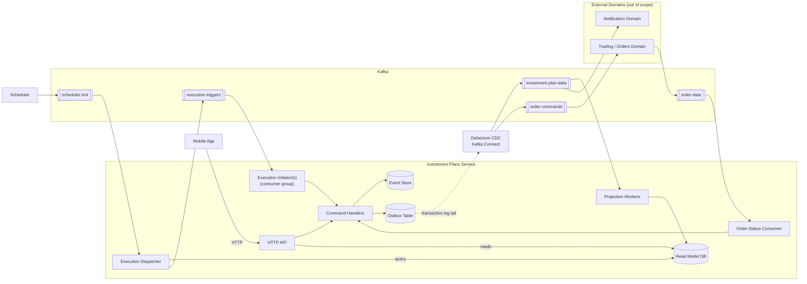

# 1. Architecture Overview

## 1.1 Components

- **Mobile App** — existing client; talks to us over HTTP only.
- **Investment Plans Service** — new, single deployable owning the Plan/Investment/Execution/Order domain; internally split by CQRS into API, Command Handlers, Event Store + Outbox, Projection Workers, Read Model, Order-Status Consumer, Execution Dispatcher, and Execution Initiator(s).
- **Debezium CDC** — existing shared infra (Kafka Connect); tails the Outbox table's transaction log and publishes rows to Kafka.
- **Scheduler** — new, tiny stateless service; publishes one daily tick. Knows nothing about plans.
- **Trading / Orders Domain** — existing, out of scope; executes orders, emits fill/reject events.
- **Notification Domain** — existing, out of scope; subscribes to our events, sends the user push/email/in-app notifications.
- **User Domain / Cash Domain** — existing, out of scope; not consumed in the MVP flow.

## 1.2 Kafka Topics

- **`investment-plan-data`** (out) — us via Debezium → Projection Workers, Notification Domain. Domain events: `PlanCreated`, `PlanEdited`, `PlanActivated`, `PlanDeactivated`, `PlanCanceled`, `ExecutionInitiated`, `ExecutionProcessed`, `OrderRequested`, `OrderStatusUpdated`.
- **`order-commands`** (out) — us via Debezium → Trading/Orders. One command per asset in a plan, issued at execution start.
- **`order-data`** (in) — Trading/Orders → Order-Status Consumer. Existing topic; fill/reject events.
- **`scheduler-tick`** (in) — Scheduler → Execution Dispatcher. One event/day: "day X has arrived."
- **`execution-triggers`** (internal) — Execution Dispatcher → Execution Initiator(s). One `ExecutionDue{plan_id, date}` per due plan, keyed/partitioned by `plan_id`.

## 1.3 Data Flow — Create / Update a Plan

Mobile App calls `POST/PUT /plans`; the Command Handler validates and appends the event (`PlanCreated`/`PlanEdited`) plus an outbox row in one transaction, then acks. Debezium tails the outbox and publishes to `investment-plan-data`; a Projection Worker upserts the read model. `GET /plans` reflects the change once the projection catches up (eventually consistent).

## 1.4 Data Flow — View a Plan / Execution

Pure CQRS read side: `GET /plans`, `/plans/{id}`, `/plans/{id}/executions[/{id}]` query the projection tables built in 1.3 directly — no command path involved.

## 1.5 Data Flow — Scheduled Execution: Dispatch

The Execution Dispatcher consumes the daily `scheduler-tick` and pages through Active plans due that day via keyset pagination, publishing one `ExecutionDue{plan_id, date}` per due plan to `execution-triggers`. It does no writes, so a crash mid-scan is safe: redelivery just triggers a full re-scan, and downstream idempotency (1.6) absorbs any duplicate.

## 1.6 Data Flow — Scheduled Execution: Initiation

An Execution Initiator consumer group consumes `execution-triggers` in parallel and issues `InitiateExecution(plan_id, date)`, keyed by `(plan_id, execution_month)` for idempotency. The Command Handler appends `ExecutionInitiated` plus one `OrderRequested` per investment, then Debezium publishes one `OrderCommand` per asset to `order-commands`.

## 1.7 Data Flow — Scheduled Execution: Order Status Resolution

Trading/Orders publishes `OrderFilled`/`OrderRejected{reason}` to `order-data`; the Order-Status Consumer issues `UpdateOrderStatus`, which appends `OrderStatusUpdated` (plus `ExecutionProcessed` once every Order in the Execution reaches a terminal state). A **permanent** rejection reason (e.g. asset delisted) also deactivates the Plan (`PlanDeactivated`); a transient one leaves the Plan unchanged. This path is fully decoupled from Dispatch/Initiation — it reacts only to `order-data`.

## 1.8 Component / Context Diagram

## 1.9 Entity Model

`Plan 1—* Investment` (contains) · `Plan 1—* Execution` (produces) · `Execution 1—* Order` (contains). `Order`'s identity is `(execution_id, asset_id)` — an Execution has at most one Order per asset — and doubles as the correlation id Trading/Orders echoes back in fill/reject events, so no separate `order_id` is needed. `Execution.execution_day` stores the full date executed; the idempotency key in 1.6 is derived from it as `(plan_id, year-month-of(execution_day))`.

## 1.10 Entity Lifecycles

- **Plan:** `Entered → Active <-> Inactive → Canceled` (terminal). `Inactive` is reached by the system (a blocking condition, e.g. an untradeable asset) or by the user pausing; the only way out is a user edit — no automatic recovery.
- **Execution:** `Initiated → Processed` — Processed means every Order reached a terminal state, not that every Order succeeded.
- **Order:** `Initiated → Filled | Rejected` (terminal).
