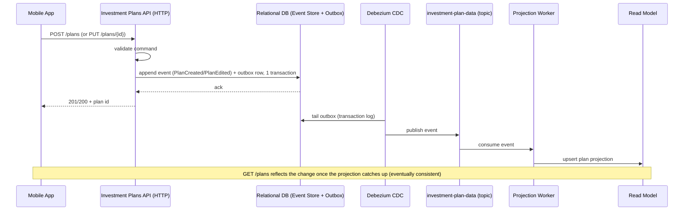
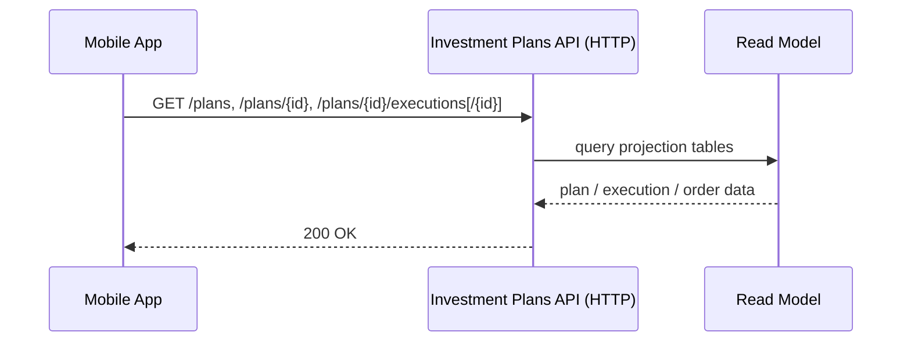
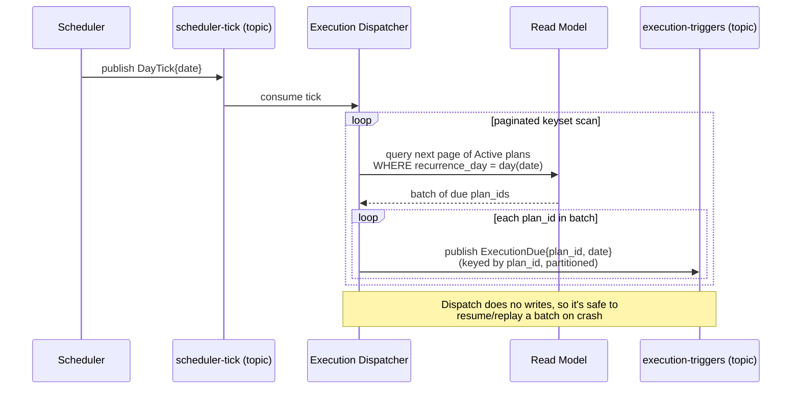
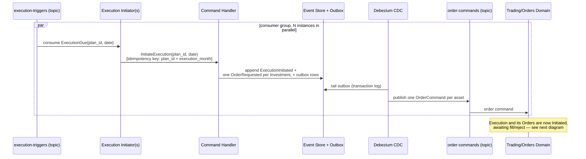
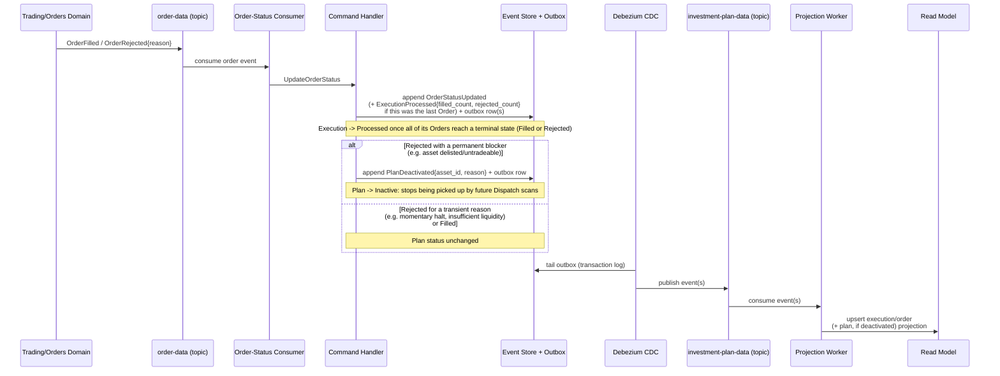
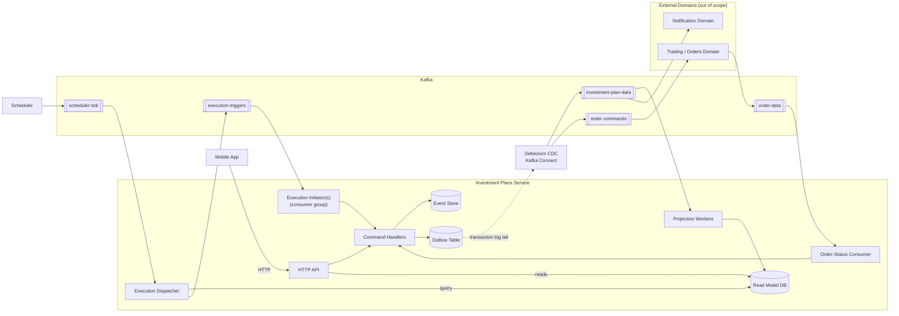
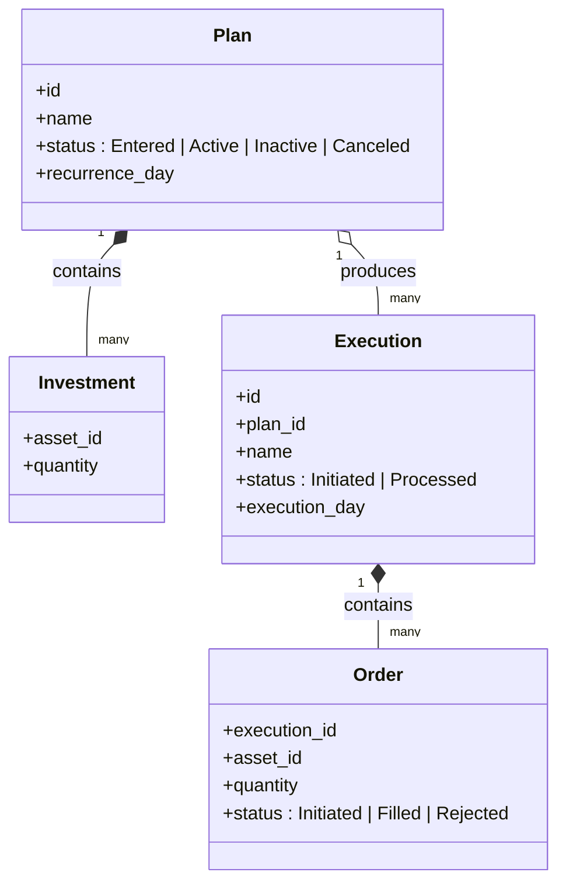
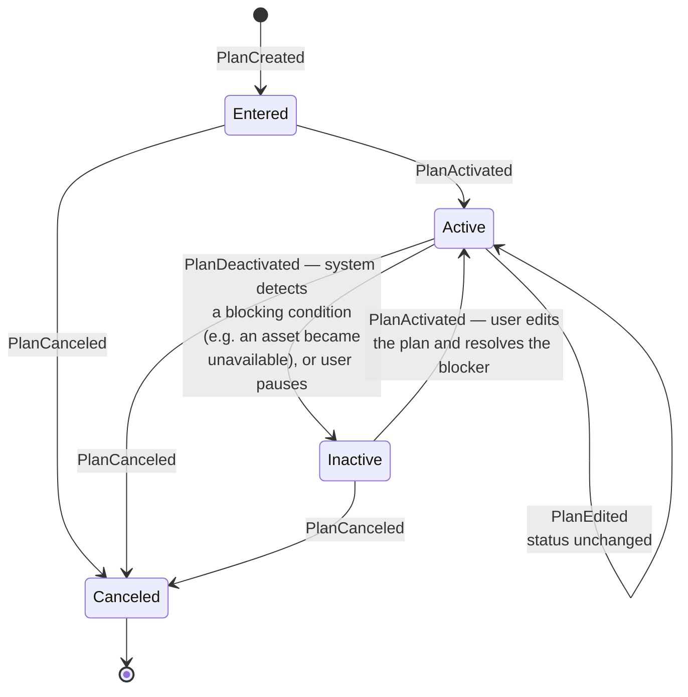
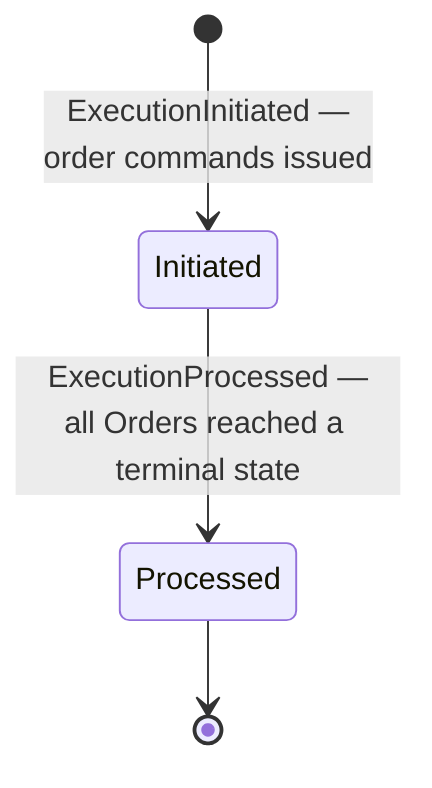
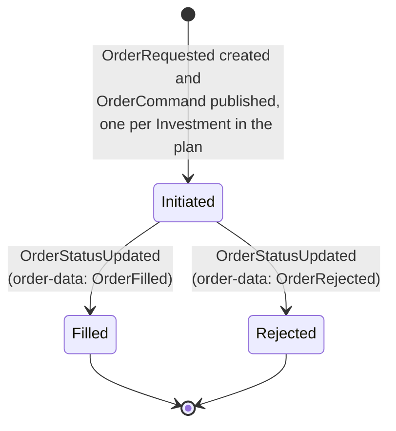

# 1. Architecture Overview

## 1.1 Components

| Component                     | Type                                        | Responsibility                                                                                                                                                                                                                                                                                           |
|-------------------------------|---------------------------------------------|----------------------------------------------------------------------------------------------------------------------------------------------------------------------------------------------------------------------------------------------------------------------------------------------------------|
| **Mobile App**                | External                                    | Existing client; talks to us over HTTP only.                                                                                                                                                                                                                                                             |
| **Investment Plans Service**  | New, single deployable                      | Owns the Plan/Investment/Execution/Order domain. Internally split by CQRS responsibility (below), but ships and scales as one service — mirroring how User/Cash/Orders are each a single domain with one topic.                                                                                          |
| — HTTP API                    | Sub-component                               | Serves `POST/GET/PUT /plans`, `GET /plans/{id}/executions[/{id}]`. Writes go through command handlers; reads go straight to the read model.                                                                                                                                                              |
| — Command Handlers            | Sub-component                               | Validate requests, load/mutate the relevant aggregate (`Plan` or `Execution`), append resulting event(s).                                                                                                                                                                                                |
| — Event Store                 | Relational Database                         | Append-only log of domain events per aggregate; source of truth.                                                                                                                                                                                                                                         |
| — Outbox Table                | Relational Database                         | Written in the *same DB transaction* as event-store appends, so an event is never lost or duplicated relative to the state change that produced it.                                                                                                                                                      |
| — Projection Workers          | Sub-component                               | Consume our own domain events off `investment-plan-data` and build the read-model tables the API queries.                                                                                                                                                                                                |
| — Order-Status Consumer       | Sub-component                               | Consumes `order-data`, matches `OrderFilled`/`OrderRejected` back to an `Order`/`Execution` by correlation id, issues an `UpdateOrderStatus` command.                                                                                                                                                    |
| — Execution Dispatcher        | Sub-component                               | Consumes `scheduler-tick`; pages through Active plans due that day via keyset pagination (bounded batches, never loads the full due-set into memory) and publishes one `ExecutionDue` message per due plan to `execution-triggers`. Does no writes itself, so a crash mid-scan is safe to resume/replay. |
| — Execution Initiator         | Sub-component, consumer group (N instances) | Consumes `execution-triggers` in parallel across partitions; issues one `InitiateExecution` command per message. Scale-out is just adding instances, up to the partition count.                                                                                                                          |
| **Debezium CDC**              | Existing shared infra (Kafka Connect)       | Tails the Outbox Table's transaction log (WAL/binlog/redo log, depending on the RDBMS) and publishes rows to Kafka. Deployed and operated separately from the service — not one of its sub-components — so it can be shared across other services' outbox tables and removes the need for the service to talk to Kafka synchronously/transactionally itself.   |
| **Scheduler**                 | New, tiny standalone service                | Stateless cron; knows nothing about plans. Once a day it publishes a single tick event. Decoupling it from plan data means editing/cancelling a plan never touches scheduling infrastructure — the next tick simply won't find it due.                                                                   |
| **Trading / Orders Domain**   | Existing, out of scope                      | Consumes order commands, executes against the market, emits fill/reject events.                                                                                                                                                                                                                          |
| **Notification Domain**       | Existing, out of scope                      | Subscribes directly to `investment-plan-data` (e.g. `PlanDeactivated`, `ExecutionProcessed`); decides channel/timing and sends the user a push/email/in-app notification. We don't build or own this — we publish events enriched enough for it to compose a message without calling back into our API (backend-to-backend stays Kafka-only). |
| **User Domain / Cash Domain** | Existing, out of scope                      | Not consumed in the MVP flow; noted as context. Cash sufficiency is discovered via the order result, not pre-checked (see Open Questions / Risks).                                                                                                                                                       |

## 1.2 Kafka Topics

| Topic                  | Direction | Producer                                | Consumer                                    | Purpose                                                                                                                                                                                                                                                                     |
|------------------------|-----------|-----------------------------------------|---------------------------------------------|-----------------------------------------------------------------------------------------------------------------------------------------------------------------------------------------------------------------------------------------------------------------------------|
| `investment-plan-data` | Out       | Investment Plans Service (via Debezium) | Projection Workers (self), Notification Domain | Domain events: `PlanCreated`, `PlanEdited`, `PlanActivated`, `PlanDeactivated{asset_id, reason}`, `PlanCanceled`, `ExecutionInitiated`, `OrderRequested`, `OrderStatusUpdated`, `ExecutionProcessed{filled_count, rejected_count}`, etc. One topic per domain, matching existing convention. `PlanDeactivated` and `ExecutionProcessed` carry enough summary context for Notification to compose a message without calling back into our API.                                |
| `order-commands`       | Out       | Investment Plans Service (via Debezium) | Trading/Orders Domain                       | One command per asset in a plan, issued when an execution starts.                                                                                                                                                                                                           |
| `order-data`           | In        | Trading/Orders Domain                   | Order-Status Consumer                       | Existing topic; we consume fill/reject events.                                                                                                                                                                                                                              |
| `scheduler-tick`       | In        | Scheduler                               | Execution Dispatcher                        | One event/day: "day X has arrived." No plan data in the payload.                                                                                                                                                                                                            |
| `execution-triggers`   | Internal  | Execution Dispatcher                    | Execution Initiator(s)                      | Fan-out topic: one `ExecutionDue{plan_id, date}` message per due plan, keyed by `plan_id` and partitioned (e.g. 32 partitions) so a consumer group of Execution Initiators processes the day's due plans in parallel instead of one consumer looping through them serially. |

> **Assumption:** `order-commands` is a new topic distinct from `order-data`, since the brief only names `order-data` for order *state*. If the Trading/Orders domain expects commands on `order-data` itself, this becomes a single bidirectional topic instead — flagged in Assumptions & Open Questions.

## 1.3 Data Flow — Create / Update a Plan

## 1.4 Data Flow — View a Plan / Execution

Pure CQRS read side: served directly from the projection tables built in 1.3.

## 1.5 Data Flow — Scheduled Execution: Dispatch

> **Why no Outbox here:** the Outbox pattern keeps a local DB write and a Kafka publish atomic — it matters where a component does both (e.g. the Command Handler appending an event *and* notifying Kafka). The Execution Dispatcher only reads the read model and produces to `execution-triggers`; there's no DB write on its side to stay in sync with, so an outbox row would add a database write and a Debezium hop per due plan (hundreds of thousands/day) for no atomicity gained. It produces directly instead, relying on an idempotent producer plus the downstream `InitiateExecution` dedup to absorb any duplicate on crash-and-retry.

> **Failure recovery:** crash mid-scan is safe by construction — delayed offset commit triggers a full re-scan on redelivery, absorbed by `InitiateExecution`'s idempotency key. Full mechanism and the poison-pill monitoring gap: `4-risks-and-mitigations.md` 4.1.

Splitting dispatch from initiation (next diagram) turns a single serial loop over potentially hundreds of thousands of rows into a bounded scan plus a Kafka-partitioned fan-out: the Execution Initiator consumer group scales horizontally just by adding instances (up to the partition count), and a crashed instance only loses its own partition's in-flight offset rather than the whole day's run. The idempotency key on `InitiateExecution` (one execution per plan per calendar month, enforced with a unique constraint in the event store) makes both dispatch replay and Kafka's at-least-once redelivery safe.

## 1.6 Data Flow — Scheduled Execution: Initiation

## 1.7 Data Flow — Scheduled Execution: Order Status Resolution

Decoupled from initiation on purpose: fills/rejects arrive from Trading/Orders asynchronously and independently per order, on no particular schedule relative to when the order command was sent. This consumer reacts purely to `order-data` — it has no dependency on the Dispatcher, Initiator, or the state of the daily batch.

This is the reactive path for parking a Plan (1.10's `PlanDeactivated` transition): the Command Handler branches on the rejection reason from Trading/Orders. A *permanent* blocker (the asset itself can't be traded, not just "not right now") also deactivates the Plan so it stops being picked up by future Dispatch scans, instead of retrying and failing every month. This requires Trading/Orders to expose a reason code that distinguishes permanent from transient rejections — flagged as an assumption to confirm, since the brief doesn't specify the shape of `OrderRejected`. It only catches the problem *after* a wasted execution attempt; catching it proactively, before the next execution day, would need a separate reconciliation flow against live asset reference data — deferred, see `5-assumptions-and-open-questions.md` 5.2 #7.

`ExecutionProcessed` and `PlanDeactivated` both carry enough summary context (fill/reject counts; the triggering `asset_id`/`reason`) for the external Notification Domain (1.1, 1.8) to compose a user-facing message directly from the event on `investment-plan-data` — no synchronous callback into our API needed, keeping notification delivery entirely out of this service's scope while still surfacing execution outcomes to the user.

## 1.8 Component / Context Diagram

## 1.9 Entity Model

`(execution_id, asset_id)` is Order's identity — an Execution has at most one Order per asset, so the pair is already unique and doubles as the correlation id sent in the order command, which the Trading/Orders domain echoes back in its `OrderFilled`/`OrderRejected` events. No separate generated `order_id` is needed.

`Execution.execution_day` stores the full calendar date the execution actually ran (e.g. `2026-09-15`), not just a day-of-month number — that's `Plan.recurrence_day`'s job. The `InitiateExecution` idempotency key (`plan_id + execution_month`, 1.6) is derived from it: `(plan_id, year-month-of(execution_day))`. Deriving from the date rather than requiring an exact-day match means a delayed retry that lands on a different calendar day within the same month still correctly collides with the original.

## 1.10 Entity Lifecycles

**Plan**

Editing an Active plan (`PUT /plans/{id}`) leaves its status Active — it's not a distinct operational state, just an event (`PlanEdited`) worth recording for audit purposes. `Canceled` is the only terminal state, reachable from `Entered`, `Active`, or `Inactive`; a canceled plan is never reactivated. `Inactive` is reachable two ways — the system parking a plan for a blocking condition (e.g. an asset in it becomes untradeable) or the user manually pausing it — and the *only* way out is a user edit; there is no automatic recovery, so a plan can sit Inactive indefinitely until the user acts. `Inactive → Active` reuses `PlanActivated` rather than a separate "reactivated" event — from the event log's perspective, re-entering Active is the same fact regardless of whether it's the first activation or a recovery.

> The *reactive* trigger for `PlanDeactivated` is designed (1.7); the proactive alternative, and the `OrderRejected` reason-code assumption it depends on, are open — see `5-assumptions-and-open-questions.md` 5.1 #2 and 5.2 #7.

**Execution**

**Order**

Execution and Order are both born already Initiated: `InitiateExecution` creates the Execution and its Orders and publishes their order commands in the same command-handler transaction (1.6), so there's no separately-observable "Planned" state to be in beforehand — the original status list's `Plan` value never actually gets persisted, so it's dropped from the model entirely (mirrors dropping `Edited` from Plan's status list).

`Processed` on an Execution means every one of its Orders reached a terminal state — it does not imply every Order was Filled. A `Rejected` Order does not block the Execution from completing; partial failure is visible at the Order level, not as a separate Execution status.

